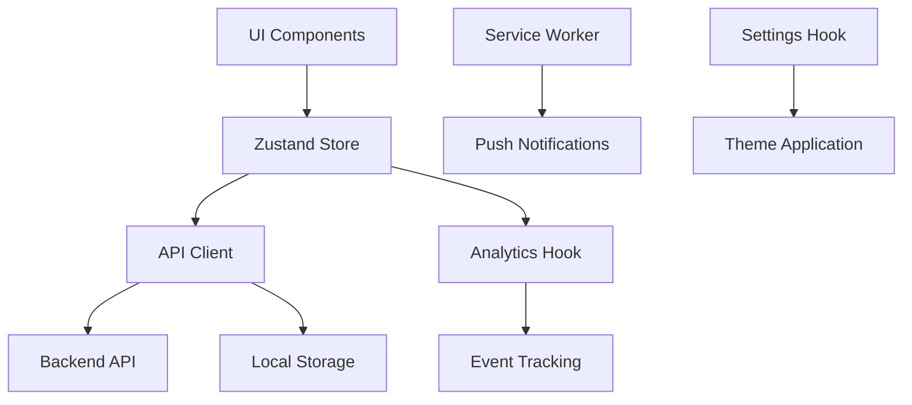

# 🏗️ Stebe Calendar - Arquitectura Mejorada

## 📋 Resumen de Mejoras Implementadas

El esqueleto de la aplicación del calendario ha sido **significativamente mejorado** con las siguientes implementaciones de **prioridad alta y media**:

### ✅ **Implementado (Prioridad Alta)**

#### 1. **Tipos Centralizados** 📝
- **Archivo**: `/src/types/index.ts`
- **Funcionalidad**: Sistema de tipos TypeScript completo y centralizado
- **Beneficios**: 
  - Eliminación de duplicación de interfaces
  - Tipado fuerte en toda la aplicación
  - Mejor experiencia de desarrollo con IntelliSense

#### 2. **API Backend Layer** 🌐
- **Archivos**: `/src/api/client.ts`, `/src/api/tasks.ts`
- **Funcionalidad**: Cliente API robusto con fallback offline
- **Características**:
  - RESTful API client con manejo de errores
  - Autenticación JWT ready
  - Fallback automático a localStorage cuando API no disponible
  - Endpoints completos CRUD + búsqueda + estadísticas

#### 3. **Sistema de Notificaciones** 🔔
- **Archivo**: `/src/hooks/useNotifications.ts`
- **Service Worker**: `/public/notification-sw.js`
- **Funcionalidad**: Notificaciones push completas
- **Características**:
  - Push notifications nativas del navegador
  - Recordatorios de tareas programables
  - Celebraciones de completado
  - Notificaciones diarias
  - Acciones interactivas (completar, posponer)

#### 4. **Estado Global Centralizado** 🗂️
- **Archivo**: `/src/store/useTaskStore.ts`
- **Tecnología**: Zustand con middleware
- **Funcionalidad**: Gestión de estado robusta
- **Características**:
  - Optimistic updates
  - Sincronización automática con API
  - Persistencia local
  - Selectors avanzados
  - DevTools integration

#### 5. **Configuraciones Avanzadas** ⚙️
- **Archivo**: `/src/hooks/useSettings.ts`
- **Funcionalidad**: Sistema de configuración completo
- **Características**:
  - Configuraciones por categoría (calendario, notificaciones, tema)
  - Presets predefinidos (productividad, minimalista, dark mode, accesibilidad)
  - Import/export de configuraciones
  - Sincronización entre pestañas
  - Aplicación automática de temas

#### 6. **Analytics de Productividad** 📊
- **Archivo**: `/src/hooks/useAnalytics.ts`
- **Funcionalidad**: Métricas avanzadas de productividad
- **Características**:
  - Tracking de eventos de tareas
  - Sesiones de focus con métricas
  - Insights de productividad
  - Score de productividad calculado
  - Exportación de datos analíticos

---

## 🏛️ Arquitectura del Sistema

### **Capas de la Aplicación**

```
┌─────────────────────────────────────────────────────────────┐
│                     UI COMPONENTS                           │
│  (React + TypeScript + Tailwind + shadcn/ui)              │
└─────────────────────────────────────────────────────────────┘
┌─────────────────────────────────────────────────────────────┐
│                    BUSINESS LOGIC                           │
│     (Custom Hooks + Zustand Store + Analytics)             │
└─────────────────────────────────────────────────────────────┘
┌─────────────────────────────────────────────────────────────┐
│                    API LAYER                                │
│        (REST Client + Offline Fallback)                    │
└─────────────────────────────────────────────────────────────┘
┌─────────────────────────────────────────────────────────────┐
│                  PERSISTENCE LAYER                          │
│  (IndexedDB + localStorage + Service Worker)               │
└─────────────────────────────────────────────────────────────┘
```

### **Flujo de Datos**



---

## 📂 Estructura de Archivos Actualizada

```
src/
├── types/
│   └── index.ts                 # Tipos centralizados
├── api/
│   ├── client.ts               # Cliente API base
│   └── tasks.ts                # API específica de tareas
├── store/
│   └── useTaskStore.ts         # Estado global con Zustand
├── hooks/
│   ├── useNotifications.ts     # Sistema de notificaciones
│   ├── useSettings.ts          # Configuraciones avanzadas
│   ├── useAnalytics.ts         # Analytics de productividad
│   ├── useTaskPersistence.ts   # Persistencia mejorada (existente)
│   └── useServiceWorkerSync.ts # Sincronización SW (existente)
├── components/
│   ├── iPhoneCalendar.tsx      # Calendario principal (existente)
│   ├── CalendarView.tsx        # Vista calendario (existente)
│   └── ... (componentes existentes)
└── pages/
    ├── Index.tsx               # Página principal (existente)
    ├── MonthlyCalendarPage.tsx # Calendario mensual (existente)
    └── ... (páginas existentes)

public/
├── service-worker.js           # SW principal (existente)
└── notification-sw.js          # SW notificaciones (nuevo)
```

---

## 🔧 Configuración y Uso

### **Variables de Entorno**

Crear archivo `.env` basado en `.env.example`:

```bash
# API Configuration
VITE_API_URL=http://localhost:3001/api

# Feature Flags
VITE_ENABLE_NOTIFICATIONS=true
VITE_ENABLE_OFFLINE_MODE=true
VITE_ANALYTICS_ENABLED=true
```

### **Instalación de Dependencias**

```bash
npm install zustand@^4.4.7
```

### **Uso de los Nuevos Hooks**

#### Estado Global con Zustand
```typescript
import { useTaskStore, useTaskSelectors } from '@/store/useTaskStore';

function MyComponent() {
  const { tasks, addTask, toggleTask } = useTaskStore();
  const { getTasksForDate } = useTaskSelectors();
  
  // Usar estado y acciones...
}
```

#### Notificaciones
```typescript
import { useNotifications } from '@/hooks/useNotifications';

function TaskComponent({ task }) {
  const { scheduleTaskNotifications, notifyTaskCompletion } = useNotifications();
  
  useEffect(() => {
    // Programar notificaciones para la tarea
    scheduleTaskNotifications(task);
  }, [task]);
}
```

#### Analytics
```typescript
import { useAnalytics } from '@/hooks/useAnalytics';

function AnalyticsPage() {
  const { metrics, insights, getProductivityScore } = useAnalytics(tasks);
  
  return (
    <div>
      <h2>Productivity Score: {getProductivityScore()}/100</h2>
      {/* Mostrar métricas e insights... */}
    </div>
  );
}
```

#### Configuraciones
```typescript
import { useSettings } from '@/hooks/useSettings';

function SettingsPage() {
  const { 
    settings, 
    updateThemeSettings, 
    exportSettings,
    getEffectiveTheme 
  } = useSettings();
  
  // Manejar configuraciones...
}
```

---

## 🚀 Funcionalidades Nuevas

### **1. Notificaciones Inteligentes**
- 📅 Recordatorios antes de tareas programadas
- 🎉 Celebraciones al completar tareas
- 🌅 Recordatorio diario matutino
- ⚠️ Alertas de fechas límite
- 🔄 Acciones desde notificaciones (completar, posponer)

### **2. Analytics de Productividad**
- 📊 Métricas detalladas (rachas, promedios, patrones)
- 🎯 Score de productividad calculado
- 💡 Insights automáticos (hora pico, día más productivo)
- 🔍 Tracking de sesiones de focus
- 📈 Tendencias y análisis temporal

### **3. Configuración Avanzada**
- 🎨 Temas y personalización visual
- 📅 Configuraciones de calendario (formato, vista por defecto)
- 🔔 Control granular de notificaciones
- 🌍 Soporte de idioma y zona horaria
- 📱 Presets predefinidos

### **4. Estado Global Robusto**
- ⚡ Optimistic updates para mejor UX
- 🔄 Sincronización automática con backend
- 💾 Persistencia multi-capa
- 🔍 Selectors optimizados
- 📱 Soporte offline completo

### **5. API Backend Ready**
- 🌐 Cliente REST completo
- 🔐 Autenticación JWT preparada
- 📱 Fallback offline automático
- 🔄 Sincronización bidireccional
- 📊 Endpoints de estadísticas

---

## 🔮 Próximas Implementaciones (Prioridad Media/Baja)

### **Prioridad Media**
- [ ] **Integración con calendarios externos** (Google, Outlook)
- [ ] **Sistema de colaboración/compartir**
- [ ] **Widgets para escritorio**

### **Prioridad Baja**
- [ ] **Exportación a otros formatos** (ICS, CSV)
- [ ] **Temas adicionales y customización avanzada**
- [ ] **Integraciones con apps de productividad**

---

## 🏆 Beneficios de las Mejoras

### **Para Desarrolladores**
- ✅ **Código más mantenible** con tipos centralizados
- ✅ **Mejor DX** con estado global y DevTools
- ✅ **Arquitectura escalable** con separación de capas
- ✅ **Testing facilitado** con hooks independientes

### **Para Usuarios**
- ✅ **Experiencia más fluida** con optimistic updates
- ✅ **Funciona offline** con sincronización automática
- ✅ **Notificaciones inteligentes** para mejor productividad
- ✅ **Insights valiosos** sobre patrones de trabajo
- ✅ **Personalización completa** según preferencias

### **Para el Producto**
- ✅ **Base sólida** para nuevas funcionalidades
- ✅ **Métricas integradas** para toma de decisiones
- ✅ **Arquitectura preparada** para escalar
- ✅ **Diferenciación competitiva** con analytics avanzados

---

## 📝 Notas de Implementación

1. **Compatibilidad**: Todas las mejoras son compatibles con el código existente
2. **Progresivo**: Las funcionalidades se pueden habilitar/deshabilitar con feature flags
3. **Performance**: Implementación optimizada con lazy loading y memoización
4. **Accesibilidad**: Configuraciones específicas para usuarios con necesidades especiales
5. **PWA Ready**: Toda la arquitectura está preparada para funcionalidad PWA completa

El esqueleto del calendario ahora es una **base sólida y escalable** lista para convertirse en una aplicación de productividad de nivel profesional. 🚀